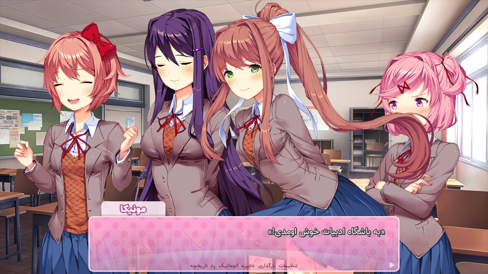

# پچ ترجمۀ فارسی باشگاه ادبیات دوکی دوکی!

__این پروژه کاملاً غیررسمی بوده و به هیچ‌وجه به تیم سالواتو مرتبط نمی‌باشد.__

## نحوۀ نصب

برای ویندوز و لینوکس:

- از قسمت [Releases](https://github.com/Gekkou-Translations/ddlc-fa-patch/releases) فایل ddlc-fa-patch-pc.zip را دانلود کنید

- بازی Doki Doki Literature Club! را از ddlc.moe دانلود کنید.

- محتویات فایل zip بازی را استخراج کنید.

- محتویات پوشهٔ DDLC-1.1.1-pc پچ ترجمه را به پوشۀ ‌DDLC-1.1.1-pc بازی منتقل
  کنید.
  
- برای باز کردن بازی در ویندوز، DDLC.exe و در لینوکس، DDLC.sh را اجرا کنید.

برای مک:

- از قسمت [Releases](https://github.com/Gekkou-Translations/ddlc-fa-patch/releases) فایل ddlc-fa-patch-mac.zip را دانلود کنید

- بازی Doki Doki Literature Club! را از ddlc.moe دانلود کنید.

- محتویات فایل zip بازی را استخراج کنید.

- روی برنامۀ بازی راست کلیک (یا کنترل کلیک) کنید و گزینۀ Show Package Contents
  را انتخاب کنید.

- محتویات پوشهٔ Contents پچ ترجمه را به پوشۀ ‌Contents بازی منتقل کنید.

## فونت‌های استفاده شده

- [ساحل (UI)](https://rastikerdar.github.io/sahel-font/)
- [میخک (UI)](https://github.com/aminabedi68/Mikhak)
- [وزیرمتن (UI)](https://rastikerdar.github.io/vazirmatn/)
- [شهرزاد (UI)](https://github.com/silnrsi/font-scheherazade)
- [عین قاف (سایوری)](https://digifonts.ir/downloads/%D9%81%D9%88%D9%86%D8%AA-%D8%AF%D8%B3%D8%AA%D9%86%D9%88%DB%8C%D8%B3-%D8%B9%DB%8C%D9%86-%D9%82%D8%A7%D9%81/)
- [شکاری (یوری)](https://irfont.ir/fonts/%D9%81%D9%88%D9%86%D8%AA-%D8%AA%D8%AD%D8%B1%DB%8C%D8%B1%DB%8C-%D8%B4%DA%A9%D8%A7%D8%B1%DB%8C/)
- [Mj قلم ۲ (یوری)](https://www.fontyab.com/192/mj_ghalam-2.html)
- [افسانه](https://www.fontyab.com/3766/afsaneh.html)
- [نوژا (ناتسوکی)](https://digifonts.ir/downloads/%D9%81%D9%88%D9%86%D8%AA-%D8%AF%D8%B3%D8%AA%D9%86%D9%88%DB%8C%D8%B3-%D9%86%D9%88%DA%98%D8%A7/)
- [فرید (مونیکا)](https://github.com/TDCMC/Farid)
- [ماشین‌تحریر (اشعار ویژه)](https://irfont.ir/fonts/%D8%AE%D8%A7%D9%86%D9%88%D8%A7%D8%AF%D9%87-%DB%8C-%D9%81%D9%88%D9%86%D8%AA-%D9%85%D8%A7%D8%B4%DB%8C%D9%86-%D8%AA%D8%AD%D8%B1%DB%8C%D8%B1/)
- [نفس (اشعار ویژه)](https://digifonts.ir/downloads/%D9%81%D9%88%D9%86%D8%AA-%D8%AF%D8%B3%D8%AA%D9%86%D9%88%DB%8C%D8%B3-%D9%86%D9%81%D8%B3/)

## تقدیر

- [پچ ترجمۀ غیررسمی ژاپنی](https://github.com/proudust/ddlc-jp-patch): الهام و پایۀ پروژه

- &#x202b;[img-encode](https://github.com/alexadam/img-encode): تبدیل عکس به طیف‌نگاره

## لینک‌های بازی

- [سایت بازی باشگاه ادبیات دوکی دوکی!](//ddlc.moe/)
- [سایت تیم سالواتو](//teamsalvato.com)
- [دستورالعمل‌های IP](//teamsalvato.com/ip-guidelines/)
